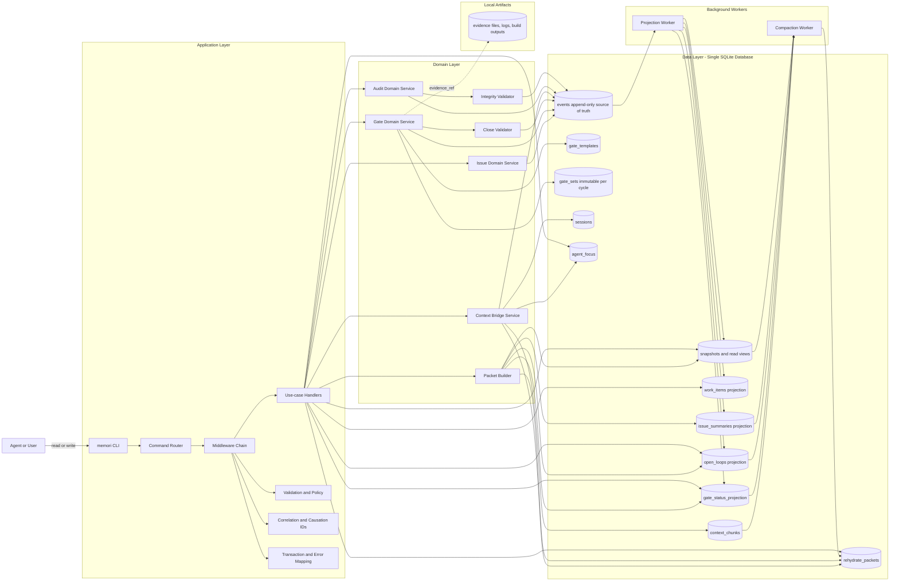
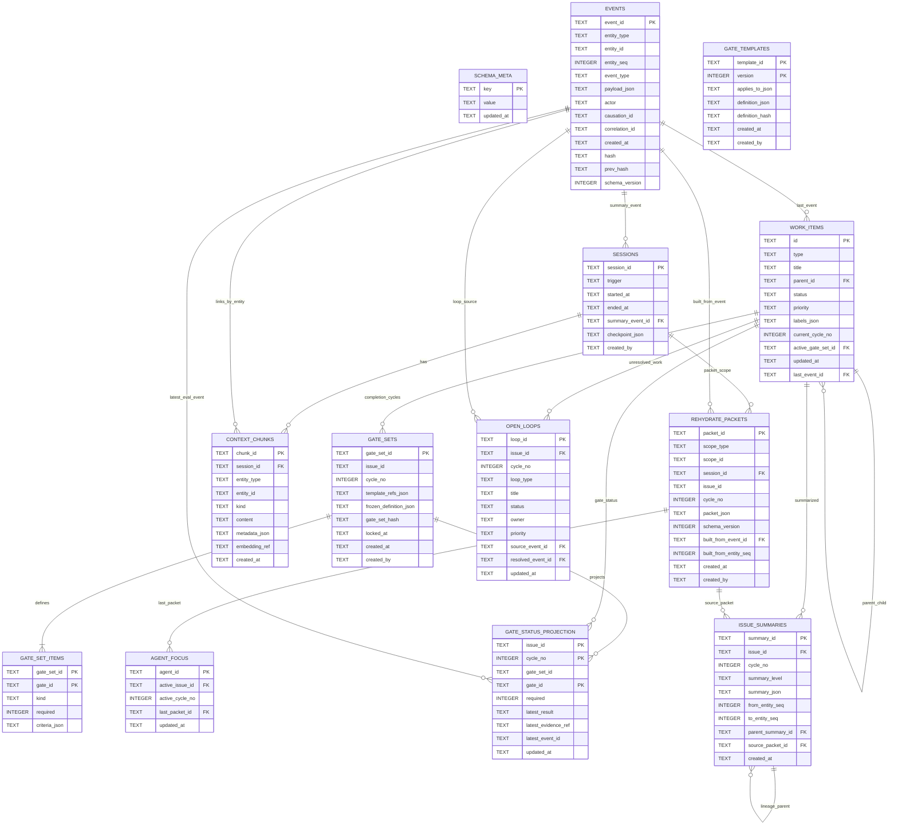

# Local Context Bridge + Agile Issue Ledger (Go/SQLite)

## Summary
Build a lightweight local system that preserves agent continuity across context limits/resets while making Agile work items first-class (`Epic`, `Story`, `Task`, `Bug`).
The system is append-only at the event layer, so every update is immutable, replayable, and traceable.
Issue completion is guarded by immutable success gates instantiated from versioned templates, so tickets cannot be closed by weakening gates mid-flight.

## Product Intent and Happy Path
- **Problem to solve**
  - Agent context and memory are finite; reset/recovery must be first-class.
  - Tracking and evolving issues in markdown files is too painful for iterative agent workflows.
  - Agents can drift by changing success gates to declare tasks done; the system must prevent this.
- **Primary user**
  - LLM agents using a CLI as their main operating interface.
  - Human operators remain first-class for governance and policy setup.
- **Ticket authorship**
  - Both humans and agents can create tickets.
  - Success criteria must be static per cycle once locked.
  - Agent-created tickets must use pre-approved gate templates or require human approval for non-template criteria.
- **Happy path**
  - Human or agent creates a ticket.
  - Static success criteria are attached and locked for the cycle.
  - Agent reviews available work and picks a ticket.
  - Agent iterates until required gates pass.
  - Agent completes the ticket only after close validation succeeds.

## System Diagram

- Clarification:
  - Every box is a component with one owner and one layer; no floating callout boxes.
  - Router dispatches, middleware wraps execution, handlers orchestrate use cases.
  - `Close Validator` is inside the Gate domain, and `Integrity Validator` is inside the Audit domain.
  - Domain services write to `events`; workers derive projections/read views from `events`.
  - Packet Builder always includes gate status + open loops + next actions in rehydrate packets.
  - All contexts share one SQLite DB via table boundaries, not separate databases.

## Implementation Changes
- **Architecture**
  - Create a Go CLI app (`memori`) with SQLite as the only required runtime dependency.
  - Use event sourcing as the source of truth; materialized read models are derived from events.
  - Keep raw conversational/context artifacts in a local store and generate compact "rehydration packets" for reset recovery.
- **Core domain model**
  - `work_items` (projection): materialized issue identity/state view (`id`, `type`, `title`, `parent_id`, `status`, `priority`, `labels`, `created_at`) derived from events.
  - `events` (append-only): (`event_id`, `entity_type`, `entity_id`, `entity_seq`, `event_type`, `payload_json`, `actor`, `causation_id`, `correlation_id`, `created_at`, `hash`, `prev_hash`).
  - `events` constraints and indexes: `UNIQUE(entity_type, entity_id, entity_seq)` for deterministic per-entity ordering, plus index on (`entity_type`, `entity_id`, `created_at`).
  - write rule for `entity_seq`: assigned in the same transaction as event insert as `max(entity_seq)+1` per entity (or equivalent atomic counter table) to avoid timestamp/id tie ambiguity.
  - `gate_templates`: versioned reusable definitions (`template_id`, `version`, `applies_to`, `definition_json`, `created_at`) with immutable versions (new version on change).
  - `gate_sets`: instantiated immutable completion contracts per issue-cycle (`gate_set_id`, `issue_id`, `cycle_no`, `template_refs`, `frozen_definition_json`, `gate_set_hash`, `locked_at`, `created_at`).
  - `sessions`: agent session boundaries (`session_id`, `started_at`, `ended_at`, `trigger`, `summary_event_id`).
  - `context_chunks`: compressed context artifacts linked to events/work items (`chunk_id`, `session_id`, `kind`, `content`, `embedding_ref`, `created_at`).
  - `rehydrate_packets`: persisted packet artifacts (`packet_id`, `scope`, `packet_json`, `built_from_event_id`, `created_at`) for deterministic reset recovery.
  - `agent_focus`: per-agent resume cursor (`agent_id`, `active_issue_id`, `active_cycle_no`, `last_packet_id`, `updated_at`).
  - `issue_summaries` (projection): lineage-aware rolling summaries (`summary_id`, `issue_id`, `cycle_no`, `summary_level`, `summary_json`, `from_entity_seq`, `to_entity_seq`, `parent_summary_id`, `created_at`).
  - `open_loops` (projection): unresolved items (`loop_id`, `issue_id`, `cycle_no`, `loop_type`, `status`, `owner`, `priority`, `source_event_id`, `updated_at`).
  - `snapshots` (derived, replaceable): current projections for fast CLI reads (`work_item_view`, `backlog_view`, `epic_rollup_view`, `open_loops_view`).
- **Agile lexicon behavior**
  - Support first-class types: `Epic`, `Story`, `Task`, `Bug`.
  - Parent/child constraints: `Epic -> Story`, `Story -> Task|Bug`; allow standalone `Task|Bug`.
  - Status workflow default: `Todo`, `InProgress`, `Blocked`, `Done`.
  - Ticket creation policy: both humans and agents may create tickets.
  - Gate definition policy: human-created tickets may define or select templates directly; agent-created tickets must bind to approved templates (or enter a human-approval step before lock).
  - Every field/state change emits events (no in-place mutation).
  - Completion gate policy: each issue cycle references one locked `gate_set`; `Done` transition is rejected unless all required gates in that set have current `PASS`.
  - Reopen policy: reopening an issue creates a new cycle with a new gate set instance; previous cycle gates/events remain immutable and auditable.
- **Context-bridge behavior**
  - On each meaningful agent update, write events plus optional context chunk references.
  - When context growth threshold is exceeded, run compaction to produce:
    - `decision_summary`
    - `open_questions`
    - `next_actions`
    - `linked_work_items`
  - Persist every generated packet in `rehydrate_packets`; packets include `schema_version` and source event cursor.
  - On reset, rehydrate from latest valid packet + unresolved work graph + recent high-relevance chunks; raw event scan is fallback/debug path only.
  - Packet section contract: `goal`, `state`, `gates`, `open_loops`, `next_actions`, `risks`.
  - Every packet must include close-eligibility and failing/blocked gate status for active issues.
- **CLI surface (v1)**
  - global output contract: all read/list commands support `--json` and output stable key order + documented schema version (`schema_version`) for machine parsing.
  - `memori help --json`
  - `memori init`
  - `memori gate template create --id ... --version ... --applies-to ... --file ... [--json]`
  - `memori gate template list [--type ...] [--json]`
  - `memori gate set instantiate --issue ... --template id@version [--template ...] [--json]`
  - `memori gate set lock --issue ... [--cycle ...] [--json]`
  - `memori gate evaluate --issue ... --gate ... --result pass|fail|blocked --evidence ... [--json]`
  - `memori gate status --issue ... [--cycle ...] [--json]`
  - `memori issue create --type epic|story|task|bug --title ... [--parent ...] [--json]`
  - `memori issue update --id ... --status ... --priority ... --label ... [--json]`
  - `memori issue link --child ... --parent ... [--json]`
  - `memori issue show --id ... [--json]`
  - `memori backlog [--json]`
  - `memori issue next [--agent ...] [--json]`
  - `memori event log --entity ... [--json]`
  - `memori context checkpoint --session ... [--json]`
  - `memori context rehydrate --session ... [--json]`
  - `memori context packet build --scope issue|session --id ... [--json]`
  - `memori context packet show --packet ... [--json]`
  - `memori context packet use --agent ... --packet ... [--json]`
  - `memori context loops --issue ... [--cycle ...] [--json]`
- **Traceability guarantees**
  - Event hash chain (`hash`, `prev_hash`) for tamper evidence.
  - Monotonic sequence per entity for deterministic replay.
  - Replay order contract: sort by (`entity_seq`) per entity and by (`created_at`, `event_id`) only for cross-entity timeline views.
  - Gate immutability contract: after `gate_set lock`, no gate definition mutation events are accepted for that `gate_set_id`.
  - Anti-cheat close contract: `issue status -> Done` event must reference a locked `gate_set_hash` and a verifier proof that all required gates are `PASS`.
  - No hard deletes; use tombstone/deprecation events.
  - Correlation metadata required for multi-step operations.

## Database Schema (v1)
- **SQLite baseline**
  - Single local DB file in WAL mode with `PRAGMA foreign_keys=ON`.
  - UTC timestamps in RFC3339 text format.
  - JSON payload columns validated with `CHECK(json_valid(...))`.

- **System tables**
  - `schema_meta`
    - columns: `key TEXT PRIMARY KEY`, `value TEXT NOT NULL`, `updated_at TEXT NOT NULL`
    - purpose: schema/data-format versioning (for migrations and `schema_version` output)

- **Event store (source of truth)**
  - `events`
    - columns: `event_id TEXT PRIMARY KEY`, `entity_type TEXT NOT NULL`, `entity_id TEXT NOT NULL`, `entity_seq INTEGER NOT NULL CHECK(entity_seq > 0)`, `event_type TEXT NOT NULL`, `payload_json TEXT NOT NULL`, `actor TEXT NOT NULL`, `causation_id TEXT`, `correlation_id TEXT`, `created_at TEXT NOT NULL`, `hash TEXT NOT NULL`, `prev_hash TEXT`, `schema_version INTEGER NOT NULL DEFAULT 1`
    - constraints: `UNIQUE(entity_type, entity_id, entity_seq)`, `UNIQUE(hash)`, `CHECK(json_valid(payload_json))`
    - indexes: `(entity_type, entity_id, created_at)`, `(correlation_id, created_at)`, `(event_type, created_at)`
    - write invariant: `entity_seq` assigned atomically per `(entity_type, entity_id)` in the same transaction as insert
  - immutability triggers
    - `BEFORE UPDATE ON events` -> `RAISE(ABORT, 'events are append-only')`
    - `BEFORE DELETE ON events` -> `RAISE(ABORT, 'events are append-only')`

- **Gate definition tables**
  - `gate_templates`
    - columns: `template_id TEXT NOT NULL`, `version INTEGER NOT NULL CHECK(version > 0)`, `applies_to_json TEXT NOT NULL`, `definition_json TEXT NOT NULL`, `definition_hash TEXT NOT NULL`, `created_at TEXT NOT NULL`, `created_by TEXT NOT NULL`
    - constraints: `PRIMARY KEY(template_id, version)`, `UNIQUE(definition_hash)`, `CHECK(json_valid(applies_to_json))`, `CHECK(json_valid(definition_json))`
    - rule: template versions are immutable; any change requires new `version`
  - `gate_sets`
    - columns: `gate_set_id TEXT PRIMARY KEY`, `issue_id TEXT NOT NULL`, `cycle_no INTEGER NOT NULL CHECK(cycle_no > 0)`, `template_refs_json TEXT NOT NULL`, `frozen_definition_json TEXT NOT NULL`, `gate_set_hash TEXT NOT NULL`, `locked_at TEXT`, `created_at TEXT NOT NULL`, `created_by TEXT NOT NULL`
    - constraints: `UNIQUE(issue_id, cycle_no)`, `UNIQUE(issue_id, gate_set_hash)`, `CHECK(json_valid(template_refs_json))`, `CHECK(json_valid(frozen_definition_json))`
    - rule: `locked_at` is one-way (`NULL -> timestamp` only)
  - `gate_set_items`
    - columns: `gate_set_id TEXT NOT NULL`, `gate_id TEXT NOT NULL`, `kind TEXT NOT NULL`, `required INTEGER NOT NULL CHECK(required IN (0,1))`, `criteria_json TEXT NOT NULL`
    - constraints: `PRIMARY KEY(gate_set_id, gate_id)`, `FOREIGN KEY(gate_set_id) REFERENCES gate_sets(gate_set_id)`, `CHECK(json_valid(criteria_json))`
    - purpose: normalized gate definitions for fast eligibility checks and status projection joins
  - gate immutability triggers
    - block `UPDATE/DELETE` on `gate_templates`
    - block `DELETE` on `gate_sets` and `gate_set_items`
    - on `gate_sets`, block updates to frozen fields (`template_refs_json`, `frozen_definition_json`, `gate_set_hash`) and block any update once `locked_at` is set (except no-op)

- **Context/session tables**
  - `sessions`
    - columns: `session_id TEXT PRIMARY KEY`, `trigger TEXT NOT NULL`, `started_at TEXT NOT NULL`, `ended_at TEXT`, `summary_event_id TEXT`, `checkpoint_json TEXT`, `created_by TEXT NOT NULL`
    - constraints: `CHECK(checkpoint_json IS NULL OR json_valid(checkpoint_json))`
  - `context_chunks`
    - columns: `chunk_id TEXT PRIMARY KEY`, `session_id TEXT NOT NULL`, `entity_type TEXT`, `entity_id TEXT`, `kind TEXT NOT NULL`, `content TEXT NOT NULL`, `metadata_json TEXT NOT NULL`, `embedding_ref TEXT`, `created_at TEXT NOT NULL`
    - constraints: `FOREIGN KEY(session_id) REFERENCES sessions(session_id)`, `CHECK(json_valid(metadata_json))`
    - indexes: `(session_id, created_at)`, `(entity_type, entity_id, created_at)`, `(kind, created_at)`
  - `rehydrate_packets`
    - columns: `packet_id TEXT PRIMARY KEY`, `scope_type TEXT NOT NULL`, `scope_id TEXT NOT NULL`, `session_id TEXT`, `issue_id TEXT`, `cycle_no INTEGER`, `packet_json TEXT NOT NULL`, `schema_version INTEGER NOT NULL`, `built_from_event_id TEXT NOT NULL`, `built_from_entity_seq INTEGER`, `created_at TEXT NOT NULL`, `created_by TEXT NOT NULL`
    - constraints: `CHECK(scope_type IN ('issue','session'))`, `CHECK(json_valid(packet_json))`, `FOREIGN KEY(session_id) REFERENCES sessions(session_id)`, `FOREIGN KEY(built_from_event_id) REFERENCES events(event_id)`
    - indexes: `(scope_type, scope_id, created_at)`, `(issue_id, cycle_no, created_at)`, `(built_from_event_id)`
  - `agent_focus`
    - columns: `agent_id TEXT PRIMARY KEY`, `active_issue_id TEXT`, `active_cycle_no INTEGER`, `last_packet_id TEXT`, `updated_at TEXT NOT NULL`
    - constraints: `FOREIGN KEY(last_packet_id) REFERENCES rehydrate_packets(packet_id)`
    - index: `(active_issue_id, active_cycle_no, updated_at)`

- **Projection/read-model tables**
  - `work_items`
    - columns: `id TEXT PRIMARY KEY`, `type TEXT NOT NULL`, `title TEXT NOT NULL`, `parent_id TEXT`, `status TEXT NOT NULL`, `priority TEXT`, `labels_json TEXT NOT NULL DEFAULT '[]'`, `current_cycle_no INTEGER NOT NULL DEFAULT 1`, `active_gate_set_id TEXT`, `updated_at TEXT NOT NULL`, `last_event_id TEXT NOT NULL`
    - constraints: `CHECK(json_valid(labels_json))`, `CHECK(status IN ('Todo','InProgress','Blocked','Done'))`
    - indexes: `(type, status)`, `(parent_id)`, `(priority, updated_at)`
  - `gate_status_projection`
    - columns: `issue_id TEXT NOT NULL`, `cycle_no INTEGER NOT NULL`, `gate_set_id TEXT NOT NULL`, `gate_id TEXT NOT NULL`, `required INTEGER NOT NULL`, `latest_result TEXT`, `latest_evidence_ref TEXT`, `latest_event_id TEXT NOT NULL`, `updated_at TEXT NOT NULL`
    - constraints: `PRIMARY KEY(issue_id, cycle_no, gate_id)`, `CHECK(required IN (0,1))`, `CHECK(latest_result IS NULL OR latest_result IN ('PASS','FAIL','BLOCKED'))`
    - index: `(issue_id, cycle_no, required, latest_result)`
  - `open_loops`
    - columns: `loop_id TEXT PRIMARY KEY`, `issue_id TEXT NOT NULL`, `cycle_no INTEGER NOT NULL`, `loop_type TEXT NOT NULL`, `title TEXT NOT NULL`, `status TEXT NOT NULL`, `owner TEXT`, `priority TEXT`, `source_event_id TEXT NOT NULL`, `resolved_event_id TEXT`, `updated_at TEXT NOT NULL`
    - constraints: `CHECK(status IN ('OPEN','RESOLVED'))`, `FOREIGN KEY(issue_id) REFERENCES work_items(id)`, `FOREIGN KEY(source_event_id) REFERENCES events(event_id)`, `FOREIGN KEY(resolved_event_id) REFERENCES events(event_id)`
    - indexes: `(issue_id, cycle_no, status)`, `(owner, status, updated_at)`
  - `issue_summaries`
    - columns: `summary_id TEXT PRIMARY KEY`, `issue_id TEXT NOT NULL`, `cycle_no INTEGER NOT NULL`, `summary_level TEXT NOT NULL`, `summary_json TEXT NOT NULL`, `from_entity_seq INTEGER NOT NULL`, `to_entity_seq INTEGER NOT NULL`, `parent_summary_id TEXT`, `source_packet_id TEXT`, `created_at TEXT NOT NULL`
    - constraints: `CHECK(json_valid(summary_json))`, `CHECK(from_entity_seq > 0)`, `CHECK(to_entity_seq >= from_entity_seq)`, `FOREIGN KEY(issue_id) REFERENCES work_items(id)`, `FOREIGN KEY(parent_summary_id) REFERENCES issue_summaries(summary_id)`, `FOREIGN KEY(source_packet_id) REFERENCES rehydrate_packets(packet_id)`
    - indexes: `(issue_id, cycle_no, to_entity_seq)`, `(summary_level, created_at)`
  - optional SQL views
    - `v_issue_close_eligibility`: required-gate completeness per `(issue_id, cycle_no)`
    - `v_event_chain_integrity`: hash-chain continuity diagnostics
    - `v_packet_gate_health`: failing/blocked gates included in packet payload contract

- **Ownership and write policy**
  - Domain services append to `events` and write immutable reference tables (`gate_templates`, `gate_sets`, `gate_set_items`).
  - Only projection/worker components write `work_items`, `gate_status_projection`, `open_loops`, `issue_summaries`, and packet materializations.
  - CLI/user paths do not write projection tables directly.

## ERD (v1)

## Dogfooding Plan (Build Memori With Memori)
- **Operating principle**
  - We will dogfood this system while building it and progressively offload active planning/execution tracking into Memori itself.
- **Offload note**
  - During bootstrap, the markdown plan remains source-of-intent.
  - Once `Slice 1` is operational (`init`, event ledger, basic issue flow), active work management is offloaded to Memori tickets and gates.
  - After offload, markdown remains architecture/reference; ticket state-of-truth lives in Memori.
- **Execution loop**
  - Create `Epic: Build Memori With Memori`.
  - Represent each delivery slice as a `Story`; break implementation into `Task`/`Bug`.
  - Require locked success gates for every active story/task before moving beyond `Todo`.
  - Allow both human and agent ticket creation, with agent-created tickets restricted to approved gate templates (or human approval path).
  - Run work via CLI only (`issue next`, `issue update`, `gate evaluate`, `context packet build/use`).
  - Enforce close-validator from day one: no ticket closes unless required gates pass.
  - Checkpoint and resume through packet-first flow daily to validate finite-context recovery.
- **Initial dogfood tickets**
  - `Story: Event Ledger + Replay`
    - gates: append-only enforcement, deterministic replay rebuild.
  - `Story: Immutable Gates`
    - gates: locked-gate mutation blocked, close blocked until all required gates pass.
  - `Story: Packet-first Resume`
    - gates: reset simulation restores active issue, open loops, and gate health.

## Delivery Vertical Slices
- `Slice 1: Ledger foundation + basic issue flow`
  - Deliver `memori init`, event store schema, and minimal projection pipeline.
  - Deliver `issue create`, `issue show`, and `event log` with optional `--json`.
  - Done when a user can create one item and replay events to rebuild the same state from an empty DB.
- `Slice 2: Agile hierarchy + backlog workflow`
  - Deliver `Epic/Story/Task/Bug` typing, parent-child linking rules, and status transitions.
  - Deliver `issue update`, `issue link`, and `backlog` views in human and json formats.
  - Done when hierarchy constraints and cycle prevention are enforced and backlog is queryable by status/type.
- `Slice 3: Immutable success gates (template + instance model)`
  - Deliver versioned gate templates and per-issue-cycle gate-set instantiation/locking.
  - Deliver gate evaluation events (`PASS|FAIL|BLOCKED`) with evidence references and gate status projection.
  - Deliver close validator that blocks `Done` until all required locked gates pass.
  - Done when attempts to modify locked gates are rejected and closure succeeds only with full gate pass proof.
- `Slice 4: Deterministic replay + audit integrity`
  - Deliver `entity_seq` assignment logic, uniqueness enforcement, and replay engine contract.
  - Deliver hash chain write/verify path and deterministic projection rebuild command.
  - Done when tamper checks fail on modified events and replay output is byte-stable across repeated rebuilds.
- `Slice 5: Session checkpoints + reset recovery`
  - Deliver `sessions`, `rehydrate_packets`, and `agent_focus` models with `context checkpoint/packet build/packet use`.
  - Deliver packet-first rehydrate flow that restores from latest valid packet before raw event fallback.
  - Done when a simulated reset resumes from `last_packet_id` and preserves gate status/open loops/next actions.
- `Slice 6: Context compaction + relevance retrieval`
  - Deliver context chunk persistence, `open_loops` + `issue_summaries` projections, and compaction trigger policy.
  - Deliver packet section contracts and mandatory gate-health inclusion.
  - Done when large histories produce compact packets with stable structure and full completion-context fidelity.
- `Slice 7: Hardening + operational ergonomics`
  - Deliver schema versioning in json output, migration path for DB upgrades, and consistency checks.
  - Deliver full automated tests for replay integrity, CLI json stability, and reset continuity scenarios.
  - Done when all test plan cases pass in CI and local reruns are deterministic.

## Test Plan
- `Issue lifecycle replay`: create/update/close items and rebuild projections from empty DB; projection state must match expected.
- `Hierarchy rules`: reject invalid parent-child links and cycles.
- `Immutability`: confirm updates append events only; prior events unchanged.
- `Agent ticket creation policy`: verify agent-created tickets can be created but cannot attach non-approved gate criteria without human approval.
- `Gate anti-drift`: verify agent cannot modify locked success criteria and cannot close by criteria mutation.
- `Gate immutability`: verify locked gate sets reject definition changes and preserve historical cycle evidence.
- `Gate close enforcement`: verify `Done` transition fails with any required gate not passed and succeeds only with full required gate pass set.
- `Template versioning`: verify template changes require a new version and do not mutate previously instantiated gate sets.
- `Trace chain`: verify hash-chain integrity and detection on tampered row.
- `Entity ordering`: verify `UNIQUE(entity_type, entity_id, entity_seq)` enforcement and deterministic replay after import/rebuild.
- `Reset continuity`: simulate session cutoff, run checkpoint + rehydrate, confirm unresolved items/next actions preserved.
- `Compaction quality`: ensure compaction output includes decisions, blockers, and next actions tied to entity IDs.
- `Packet contract`: validate packet sections (`goal/state/gates/open_loops/next_actions/risks`) are always present and schema-valid.
- `Packet gate health`: validate failing/blocked required gates are always present in rehydrate packet output.
- `Open loops continuity`: validate unresolved loops survive reset and transition correctly to `RESOLVED` with source/resolution events.
- `Summary lineage`: validate `issue_summaries` lineage links and deterministic regeneration from event ranges.
- `Agent focus resume`: validate `agent_focus.last_packet_id` restores same working set across process restarts.
- `LLM discoverability`: validate `help --json` and `issue next --json` provide sufficient structured guidance to pick and execute the next ticket.
- `CLI usability`: validate key commands produce deterministic machine-readable output (`--json`, stable keys, `schema_version`) and human-readable output.

## Assumptions and Defaults
- Single-user local-first system in v1; `actor` defaults to local profile.
- SQLite in WAL mode; all timestamps stored in UTC.
- Go + SQLite chosen for runtime.
- Agent runtime defaults to packet-first context restore; direct raw event-log reads are for fallback/debug workflows.
- No Sprint/Milestone entities in v1 (can be added as new entity/event types later).
- Embeddings/relevance can start keyword-based in v1.0 and be upgraded without schema break by adding new chunk-index tables.
