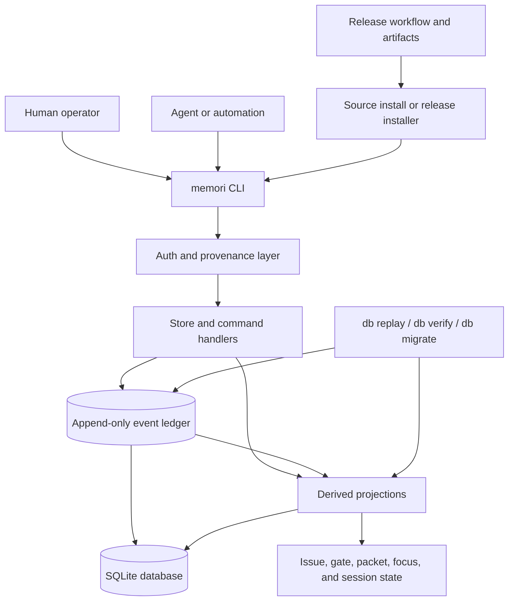
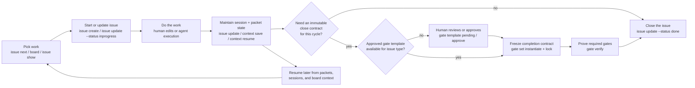

<p align="center">
  
</p>

# memori

**memori** is a local-first issue tracker and continuity bridge for human-and-agent workflows.

It combines three ideas in one CLI:

- an append-only event ledger for every mutation
- issue lifecycle management with explicit completion gates
- issue and session packets for handoff, resume, and recovery

All state lives in a local SQLite database. The CLI is the product surface today: no server, no web UI, no remote control plane.

## Why memori exists

Traditional issue trackers are good at coordination, but they are not designed for agent continuity, deterministic replay, or proof-backed completion. memori is for workflows where you want:

- local ownership of project state
- immutable history for issue and gate changes
- auditable human and LLM mutations
- enforced close criteria instead of informal “done” status changes
- explicit handoff and resume paths when an agent session loses context

## Core model

| Capability | What it does |
| --- | --- |
| Event ledger | Records issue, gate, session, packet, focus, and approval changes as append-only events. |
| Issue system | Supports `Epic`, `Story`, `Task`, and `Bug` with parent-child links, status updates, and backlog views. |
| Completion gates | Freezes gate definitions per issue cycle and blocks `done` until required gates are verified. |
| Context bridge | Captures checkpoints, builds reusable packets, tracks agent focus, and supports rehydration. |
| Replay | Rebuilds projections from the event ledger with `memori db replay`. |
| Provenance | Distinguishes human and LLM actors and applies stricter policy to executable gate criteria. |

## Sessions, packets, and focus

- A session is a working window for an issue. Checkpoints and summaries belong to the session.
- An issue packet is the durable issue snapshot. It helps `issue show`, `issue next`, `board`, and agent focus answer "what matters on this ticket right now?"
- A session packet is the handoff artifact for a specific working window. It helps `context resume` and `context rehydrate` answer "where did I leave off?"
- Agent focus points a worker at the issue it should resume, usually from the latest issue packet.

## System architecture



The CLI is the only product surface today. It writes append-only events, rebuilds derived state from that ledger, and exposes the resulting issue, gate, packet, focus, and session views from the local SQLite store.

## What the repository includes today

- SQLite-backed local database, defaulting to `.memori/memori.db`
- `issue create`, `issue update`, `issue show`, `issue link`, `backlog`, `board`, and `issue next`
- append-only event log with deterministic ordering and idempotent command handling
- gate template creation, approval, instantiation, locking, evaluation, verification, and status inspection
- close validation that always requires closed child issues, and requires passing gates only when the current cycle has a locked gate set
- issue and session packet flows, open-loop tracking, session checkpoints, and rehydration
- hierarchy-aware board snapshots plus an interactive TUI with parent/child navigation and `/` issue search
- replay, migration, verification, and backup database operations
- human password-based mutation auth and explicit LLM provenance for automation

## Interactive board architecture

The interactive `memori board` path is intentionally CLI-native and terminal-first, but it follows a clear UI architecture:

- Bubble Tea owns the board runtime: program lifecycle, messages, refresh scheduling, resize handling, and async snapshot/audit loading.
- Bubbles owns generic interactive surfaces inside the board: search input, inspector viewport behavior, help metadata, and loading spinner behavior.
- Lip Gloss is the sole board styling and layout layer for headers, tabs, panels, rows, overlays, help surfaces, footer text, toast states, and framed layouts.
- Board-specific code owns domain state and content assembly: lane selection, hierarchy navigation, detail vs continuity mode, history toggle, search result ranking, and continuity guidance text.

When adding new board UI behavior, prefer extending those layers instead of introducing bespoke terminal widgets or raw ANSI assembly. New interactive surfaces should default to Bubble Tea plus Bubbles components, and new visual treatment should be expressed through Lip Gloss styles and layout primitives.

## Current boundaries

memori is already useful for local workflow design and disciplined execution, but it is still intentionally narrow:

- single-user, local-only operation
- no hosted sync, multi-user coordination layer, or web UI
- no external integrations beyond the CLI and local filesystem
- source checkout and Go toolchain expected for evaluation

## Adoption policy

License:

- memori is available under the MIT license. See [LICENSE](LICENSE).

Intended audience:

- teams experimenting with local-first human-and-agent workflows
- repositories that want issue tracking, replay, continuity, and gate-backed completion in one CLI

Stability expectations:

- the CLI is usable today, but the product is still early and evolving
- database migrations are supported forward through `memori db migrate`, but older binaries may not understand newer schema versions
- automation should prefer JSON output and explicit command IDs where reproducibility matters
- if you are working inside a checked-out `memori` repository, prefer `go run ./cmd/memori ...` over an installed `memori` binary so commands match the code and schema in your current branch

Support expectations:

- this repository is maintained as an actively developed project, not a hosted service with uptime or compatibility guarantees
- adopters should review release notes, keep database backups, and validate upgrades with `memori db status` and `memori db verify`

## Install and run

Prerequisites:

- Go 1.25+
- access to `github.com/willbastian/memori`

Public module path:

```text
github.com/willbastian/memori
```

Install the CLI from source without cloning the repository:

```bash
go install github.com/willbastian/memori/cmd/memori@latest
memori version
memori help
```

When you are developing or testing inside a checked-out `memori` repository, prefer the repo-local entrypoint instead of any installed binary:

```bash
go run ./cmd/memori version
go run ./cmd/memori help
```

If you want the current branch directly instead of the latest resolved module version, use:

```bash
go install github.com/willbastian/memori/cmd/memori@main
```

Install from published release artifacts without building from source:

```bash
curl -fsSL https://raw.githubusercontent.com/willbastian/memori/main/scripts/install_release.sh | bash
memori version
```

To pin a specific release:

```bash
curl -fsSL https://raw.githubusercontent.com/willbastian/memori/main/scripts/install_release.sh | bash -s -- --version v0.1.0
```

The supported installer channel in this repository is [install_release.sh](scripts/install_release.sh). It downloads the matching archive from the project's GitHub releases and installs `memori` into `~/.local/bin` by default. Maintenance for that installer flow lives in this repository alongside the release workflow and docs.

Or run from a local checkout:

Run directly from source:

```bash
go run ./cmd/memori help
```

Or build a binary:

```bash
go build -o memori ./cmd/memori
./memori help
```

Examples below use `go run ./cmd/memori`. Replace that prefix with `memori` if you build the binary.

## Release artifacts

Tagged releases build cross-platform archives for:

- macOS `amd64`
- macOS `arm64`
- Linux `amd64`
- Linux `arm64`

The automation lives in [.github/workflows/release.yml](.github/workflows/release.yml) and uses [scripts/build_release_artifacts.sh](scripts/build_release_artifacts.sh) so the same build flow can run locally or in GitHub Actions.

The test-and-coverage CI lives in [.github/workflows/ci.yml](.github/workflows/ci.yml) and uses [scripts/check_coverage_baseline.sh](scripts/check_coverage_baseline.sh). It runs on every branch push plus pull requests targeting `main`, executes `go test ./...`, and fails if total Go statement coverage drops materially below the committed baseline. The script includes a small default `0.25` percentage-point tolerance so harmless cross-platform coverage drift does not fail CI.

To cut a release from a tag:

```bash
git tag v0.1.0
git push origin v0.1.0
```

That workflow builds `tar.gz` archives plus `SHA256SUMS.txt` and attaches them to the matching GitHub release. You can also run the same archive build locally:

```bash
./scripts/build_release_artifacts.sh v0.1.0 dist
```

Release binaries embed:

- the CLI version string
- the source commit
- the build timestamp
- the binary's embedded schema head version

You can inspect that metadata with:

```bash
memori version
memori version --json
```

Schema compatibility expectations:

- a binary can inspect and migrate an older memori database up to its embedded schema head version
- if a database has already been migrated beyond the binary's reported `schema_head_version`, use a newer memori binary before making changes
- use `memori db status` to compare the current database version with the binary's expected schema head

## Adopt memori in a new repository

These steps assume you installed the `memori` binary. If you are working from a local checkout instead, replace `memori` with `go run ./cmd/memori`.

## Human and agent workflow



Humans and agents operate against the same ledger. The shortest path is: pick tracked work, move it into progress, do the work, let memori keep continuity current, and then either close the issue directly or freeze and verify a close contract for that cycle before marking the issue `done`.

By default, issue lifecycle commands now maintain the right continuity artifacts for you:

- `issue update --status inprogress` starts or continues the session, refreshes the issue packet after the status write, and updates agent focus when you pass `--agent`.
- `issue update --status blocked` summarizes the active session and saves a fresh session packet for handoff.
- `issue update --status done` does the same and closes the session when the close transition succeeds.
- `issue update --session <id>` lets you pin auto continuity to a specific session when the same issue has parallel work in flight.
- If auto continuity cannot complete or session selection is ambiguous, the command now fails before the status write is applied.
- `context resume` restores the latest session payload, and with `--agent` plus no `--session` it prefers the session associated with that agent's saved focus before falling back to the latest open session.

Packets are useful in different ways:

- Issue packets keep the ticket-level state fresh. They power ranked recommendations, issue inspection, board continuity signals, and focus updates.
- Session packets keep the working-window state fresh. They power pause, resume, recovery, and handoff after a specific attempt or editing session.

You can tune that behavior with continuity automation modes:
- `auto`: the default. Start, pause, and close issue transitions bundle the continuity writes directly into the command.
- `assist`: keep continuity explicit, but have `issue update` print the exact issue-scoped `context start`, `context save`, or `context save --close` command that matches the transition you just made, preserving an explicit `--session` when you pinned one.
- `manual`: disable automatic continuity for the command and skip the extra assist bundle guidance.

Choose a mode per command with `--continuity manual|assist|auto`, or set `MEMORI_CONTINUITY_MODE` to make it the default for your shell session.

### 1. Initialize project state

From the root of the repository you want to track:

```bash
memori init --issue-prefix acme --append-agents-md
memori db status
memori backlog
```

The default database path is `.memori/memori.db` inside that repository. Issue keys will use the prefix you choose, for example `acme-a1b2c3d`.

If the repository uses `AGENTS.md` for collaborator guidance, add `--append-agents-md` during init to append Memori's standard "Land The Plane" closeout checklist in the current repo. The managed block is idempotent, so rerunning the command updates that block instead of duplicating it.

### 2. Set up human writes

Human writes are authenticated interactively.

1. Leave `MEMORI_PRINCIPAL` unset, or set it to `human`.
2. Configure a password once:

```bash
memori auth set-password
memori auth status
```

After that, human write commands prompt for the configured password.

### 3. Set up agent or automation writes

For non-interactive mutation flows, declare an LLM principal explicitly:

```bash
export MEMORI_PRINCIPAL=llm
export MEMORI_LLM_PROVIDER=openai
export MEMORI_LLM_MODEL=gpt-5
```

If your automation needs stable externally supplied command IDs for retries or cross-tool correlation, also export:

```bash
export MEMORI_ALLOW_MANUAL_COMMAND_ID=1
```

### 4. Use it day to day

For humans:

```bash
memori board --watch --interval 5s
memori issue show --key acme-a1b2c3d
memori gate status --issue acme-a1b2c3d
```

For agents:

```bash
memori issue next --agent writer-1 --json
memori issue update --key acme-a1b2c3d --status inprogress --agent writer-1 --json
memori context resume --agent writer-1 --json
memori issue update --key acme-a1b2c3d --status blocked --note "waiting on review" --json
```

New issues default to generated keys in `{prefix}-{shortSHA}` format when you omit `--key`. Mutation commands also generate command IDs automatically unless you explicitly opt into supplying your own with `MEMORI_ALLOW_MANUAL_COMMAND_ID=1`.

### 5. Upgrade safely

When you upgrade the binary in an existing repository:

```bash
memori version
memori db status
memori db backup --out /tmp/memori-pre-upgrade.db --json
memori db migrate --json
memori db verify --json
```

That keeps the binary version, schema version, and migration audit aligned before you resume normal work.

## End-to-end flows

### 1. Human-managed issue lifecycle

This is the most structured issue-to-done path: create an issue, optionally freeze a completion contract for the current cycle, verify the required gate, then close it.

```bash
go run ./cmd/memori init --issue-prefix mem
go run ./cmd/memori auth set-password

go run ./cmd/memori issue create \
  --key mem-a111111 \
  --type task \
  --title "Ship polished public README"

cat >/tmp/memori-gates.json <<'JSON'
{"gates":[{"id":"build","kind":"check","required":true,"criteria":{"command":"go test ./..."}}]}
JSON

go run ./cmd/memori gate template create \
  --id release-checks \
  --version 1 \
  --applies-to task \
  --file /tmp/memori-gates.json

go run ./cmd/memori gate set instantiate \
  --issue mem-a111111

go run ./cmd/memori gate set lock --issue mem-a111111
go run ./cmd/memori gate verify --issue mem-a111111 --gate build
go run ./cmd/memori issue update --key mem-a111111 --status done
```

What happens in this flow:

- the issue is stored in the local ledger
- `gate set instantiate` auto-selects the single eligible template for the issue type when you omit `--template`; if more than one template family fits, the CLI tells you to choose explicitly
- the gate set freezes the completion contract for the issue’s current cycle
- `gate verify` executes the approved verifier command and stores evidence plus proof metadata
- `issue update --status done` succeeds without gate setup when no locked close contract exists for the current cycle
- once a gate set is locked for the current cycle, `issue update --status done` succeeds only if required gates pass and child issues are already closed

If you close an issue ungated and later decide that future completion needs an immutable contract, reopen the issue first. Reopening advances the issue to a new cycle, clears the active gate set pointer, and gives the new cycle its own gate contract without rewriting the meaning of the earlier ungated close.

Issue metadata can still be revised later with append-only updates, including title changes such as:

```bash
go run ./cmd/memori issue update --key mem-a111111 --title "Ship public README and onboarding flow"
```

### 2. Agent execution against the same ledger

Agents use the same issue model, but mutations carry explicit LLM provenance. In practice, agents should rely on approved gate templates for executable checks.

The example below passes explicit command IDs for deterministic demonstration. In normal agent usage, memori can generate command IDs automatically.

```bash
export MEMORI_PRINCIPAL=llm
export MEMORI_LLM_PROVIDER=openai
export MEMORI_LLM_MODEL=gpt-5
export MEMORI_ALLOW_MANUAL_COMMAND_ID=1

go run ./cmd/memori init --db /tmp/memori-agent.db --issue-prefix mem

go run ./cmd/memori issue create \
  --db /tmp/memori-agent.db \
  --key mem-a222222 \
  --type task \
  --title "Validate recovery flow" \
  --description "Exercise packet-first resume behavior" \
  --command-id demo-agent-create-01 \
  --json

go run ./cmd/memori issue update \
  --db /tmp/memori-agent.db \
  --key mem-a222222 \
  --status inprogress \
  --agent agent-demo-1 \
  --priority P1 \
  --command-id demo-agent-progress-01 \
  --json

go run ./cmd/memori issue next \
  --db /tmp/memori-agent.db \
  --agent agent-demo-1 \
  --json
```

For executable gates, the expected flow is:

1. agents can create executable templates, but unapproved versions stay pending human review
2. humans can inspect the pending review queue with `gate template pending` and approve the exact template version with `gate template approve`, or create it as a human-governed actor
3. the agent instantiates and locks that approved gate set for the issue
4. the agent runs `gate verify` and then marks the issue `done`

Template review states fit together like this:

- draft: the proposed gate definition still only exists in a file or command payload and has not been written to the ledger yet
- pending: an executable template was created by an LLM-governed actor, so it exists in the ledger but cannot be instantiated or verified until a human approves that exact version
- approved: a human approved the executable template version, or the executable template was created directly by a human-governed actor
- runnable: the approved template can be instantiated into a gate set for an issue cycle and then used by `gate verify`

A human reviewer can work the queue with:

```bash
go run ./cmd/memori gate template pending --json
go run ./cmd/memori gate template approve --id <template-id> --version <n> --json
go run ./cmd/memori gate template pending --json
```

After approval, that template version disappears from the pending queue and becomes runnable for gate-set instantiation.

### 3. Live board view for terminal splits

Use `board` when you want a continuously refreshing terminal snapshot instead of rerunning multiple inspection commands by hand. When stdout is attached to a terminal and `--watch` is not set, `memori board` opens the interactive Bubble Tea TUI automatically, with Lip Gloss layout and styling for the live board surfaces.

```bash
go run ./cmd/memori board
go run ./cmd/memori board --watch --interval 5s
go run ./cmd/memori board --agent writer-1 --watch --interval 3s
go run ./cmd/memori board --agent writer-1 --json
```

In the interactive TUI:

- `j` / `k` move through issues
- `h` / `l` switch lanes
- arrow keys mirror the same navigation when that feels more natural in your terminal
- `f` toggles between the fast actionable view and an all-work history view that includes `Done` and `WontDo`
- `[` jumps to the parent issue and `]` jumps to the first child
- `{` collapses children and `}` expands them
- `/` opens issue-id search and `enter` jumps to the selected result
- `ctrl+u` / `ctrl+d` and `pgup` / `pgdn` scroll the inspector pane without losing the current issue selection
- `space` / `enter` open or close the detail pane for the selected issue
- `c` opens the continuity pane, then toggles between continuity and detail while the pane is open
- `?` opens help, and `q` exits

The current terminal visual direction aims for a calmer, title-first board:

- Bubble Tea owns refresh, key handling, quit behavior, and terminal resize updates so the interactive path stays responsive without a hand-rolled raw-terminal loop
- Lip Gloss owns the layout and styling for the header, tabs, issue list, search, detail, continuity, and footer surfaces
- the main board surfaces use a calmer shell, with the list staying primary and temporary modes like help and search rendering as centered overlay-style panels on wide terminals
- the default wide layout stays list-first so you can scan work before opening extra context
- rows lead with titles first, then compact issue/type/status metadata, with an explicit left-edge selection marker so focus does not depend only on color
- chrome stays quieter than the issue text, with the header carrying only the board title and optional agent context, the lane strip acting like a compact dashboard nav, and the footer carrying just the active hints
- detail and continuity inspection behave more like an inspector sidebar: identity and next action first, then supporting context, with preserved scroll position per issue and pane mode
- snapshot and continuity refreshes surface loading, stale, and failed states in the inspector instead of silently dropping context
- search behaves more like a lightweight command palette, with match counts, empty-state hints, and clearer result emphasis
- in narrow layouts, opening detail or continuity gives that pane the body instead of clipping the issue content under a tiny list preview

Example wide-layout mockup:

```text
 MEMORI BOARD                                                                          AGENT WRITER-1
 NEXT 1   ACTIVE 2   BLOCKED 1   READY 7
 READY
 > Refresh stale packet  · mem-a111111 · task
   Tighten close gates   · mem-b222222 · story
   Parent epic           · mem-fffffff · epic · in progress

 mem-a111111  · task · Refresh stale packet  ·  enter detail  c continuity  f history  ? help
```

Tradeoffs and constraints behind that direction:

- expressiveness lives mostly in layout, spacing, and restrained badges so dense descriptions and acceptance criteria remain low-friction to scan
- every visual cue keeps an ASCII/text equivalent; color improves speed but never carries the only meaning
- the TUI keeps detail and continuity panes on demand instead of assuming split-pane mode is always helpful
- `board` output still stays compatible with terminal history, logs, and copy/paste workflows
- the palette intentionally avoids subtle low-contrast gradients that look good in screenshots but become muddy across common terminal themes and remoting setups

The board surfaces:

- active work (`InProgress`)
- blocked work (`Blocked`)
- ready work (`Todo`) ranked from existing `issue next` guidance
- full parent/child hierarchy context in the `Active` and `Ready` lanes so related adjacent work stays visible even when siblings or parents are in a different status
- likely next work, including continuity signals such as focus, packets, open loops, and gate state
- a continuity audit pane for the selected issue, including the resolved path, candidate sessions and packets, recent writes, and integrity alerts
- completed and declined work through the all-work history view (`Done` and `WontDo`)
- hierarchy context such as parent, child, depth, and sibling metadata for each issue
- ambient continuity pressure for active, blocked, or resume-rich work when packets are stale, missing, or already helping

For split panes, keep one shell running `board --watch` and do mutations in another. When stdout is attached to a real terminal, watch mode redraws in place instead of appending endless snapshots. Use `--agent` when you want the likely-next panel to reflect a specific worker's current focus and recovery packet state.

### 4. Resume and handoff flow

The default happy path is issue-driven:

```bash
go run ./cmd/memori issue update \
  --key mem-a111111 \
  --status inprogress \
  --agent writer-1 \
  --json

go run ./cmd/memori issue show --key mem-a111111

go run ./cmd/memori issue update \
  --key mem-a111111 \
  --status blocked \
  --note "paused after reproducing the gate failure" \
  --json

go run ./cmd/memori context resume --agent writer-1 --json
go run ./cmd/memori context loops --issue mem-a111111 --json
```

When you need lower-level control, the continuity commands are still available:

```bash
go run ./cmd/memori context start --issue mem-a111111 --agent writer-1 --json
go run ./cmd/memori context save --session <session-id> --note "handoff" --close --reason "handoff captured" --json
go run ./cmd/memori context packet build --scope issue --id mem-a111111 --json
go run ./cmd/memori context packet build --scope session --id sess-20260307-01 --json
go run ./cmd/memori context packet show --packet <packet-id> --json
go run ./cmd/memori context packet use --agent writer-1 --packet <issue-packet-id> --json
go run ./cmd/memori context rehydrate --session sess-20260307-01 --json
```

- Use `context start`, `context save`, and `context resume` for the high-level continuity verbs.
- Use `checkpoint`, `summarize`, `close`, `packet build`, `packet show`, `packet use`, and `rehydrate` when you want explicit control over the underlying pieces.
- `context resume` prefers packet-backed session restore and falls back to recent session context or a closed-session summary when needed.
- Human output tells you which session was used, and issue surfaces now point to issue-scoped resume commands when an open session already exists.

Issue packets currently include goal, state, decision summary, open questions, linked work items, gates, open loops, next actions, risks, continuity metadata, and provenance metadata.

`issue next` uses these continuity signals as part of triage, so an agent can prefer work that already has focus, a fresh issue packet, unresolved loops, or failing gates that need attention.

### 5. Replay and integrity checks

When you want to rebuild derived state from the ledger, use replay:

```bash
go run ./cmd/memori db replay --json
```

When you want to confirm the database and event chain are internally consistent, use:

```bash
go run ./cmd/memori db migrate --json
go run ./cmd/memori db verify --json
go run ./cmd/memori db status --json
go run ./cmd/memori db backup --out /tmp/memori-backup.db --json
```

`db migrate` now creates a restore-point backup before applying schema changes and returns the backup path in JSON output.
`db verify` checks both the event hash chain and the `schema_migrations` audit ledger so checksum drift or missing migration audit rows are reported alongside schema-version issues.

Use replay when projections need to be recomputed. Use rehydrate when a worker needs to resume efficiently from the latest packet or fallback context.

## Current operator loop

For day-to-day work, the shortest path is usually:

1. `memori board` or `memori board --agent <id>` to see active, blocked, ready, and likely-next work.
2. `memori issue next --agent <id> --json` when an agent needs a ranked continuity-aware recommendation.
3. `memori issue update --key <issue> --status inprogress --agent <id>` to start work, refresh the issue packet, and align focus in one step.
4. `memori issue show --key <issue>` before editing to inspect packet freshness, open sessions, and resume guidance.
5. `memori issue update --key <issue> --status blocked --note "<handoff>"` or `--status done --note "<summary>" --reason "<close reason>"` to save a fresh session packet at pause or close.
   If the same issue has multiple open sessions, add `--session <id>` so memori does not have to guess which session you are pausing or finishing.
6. `memori context resume --agent <id>` when returning to paused work from the latest saved session packet.
7. `memori gate template list --json` when you need to find a close template before locking gates for a cycle.
8. `memori gate template pending --json` when you need to review executable templates that are still awaiting human approval.
9. `memori version --json` when you need the binary build metadata and embedded schema head version.

## Command map

### Inspection

- `memori help`
- `memori version`
- `memori backlog`
- `memori board`
- `memori issue show`
- `memori gate status`
- `memori event log`
- `memori db status`
- `memori auth status`

### Issue and gate mutation

- `memori init`
- `memori auth set-password`
- `memori issue create`
- `memori issue update`
- `memori issue link`
- `memori gate template create`
- `memori gate template approve`
- `memori gate template list`
- `memori gate template pending`
- `memori gate set instantiate`
  - omit `--template` to auto-select the single eligible template for the issue type
  - pass `--template <template@version>` to override or resolve ambiguity explicitly
- `memori gate set lock`
- `memori gate evaluate`
- `memori gate verify`

### Agent continuity

- `memori issue next`
- `memori board`
- `memori context start`
- `memori context save`
- `memori context checkpoint`
- `memori context summarize`
- `memori context close`
- `memori context resume`
- `memori context packet build`
- `memori context packet show`
- `memori context packet use`
- `memori context rehydrate`
- `memori context loops`

- `issue create`, `issue update`, `issue show`, and `issue next` surface continuity guidance when the work state makes it relevant.
- `issue update --status inprogress` starts or continues continuity, refreshes the issue packet after the status write, and aligns focus when you pass `--agent <id>`.
- `issue update --status blocked|done` saves continuity from the issue's active session; when the same issue has multiple open sessions, pass `--session <id>` to keep the save/close path explicit. `issue show`, `issue next`, and `board` surface packet freshness, session availability, focus, and scoped resume hints.

### Database operations

- `memori db migrate`
- `memori db verify`
- `memori db backup`
- `memori db replay`

## Event entities you can inspect directly

`event log` accepts plain issue keys and explicit entity prefixes.

Examples:

- `memori event log --entity mem-a111111`
- `memori event log --entity session:sess-20260307-01`
- `memori event log --entity packet:<packet-id>`
- `memori event log --entity focus:writer-1`
- `memori event log --entity gate-template:release-checks@1`
- `memori event log --entity gate-set:<gate-set-id>`

JSON event logs include `causation_id` and `correlation_id` so related commands can be traced across retries and multi-step workflows.

## Development

Run the full test suite:

```bash
go test ./...
```

Run the same full-suite coverage check that GitHub Actions enforces:

```bash
./scripts/check_coverage_baseline.sh
```

The coverage check compares against the committed baseline in `.github/coverage-baseline.txt` with a default `0.25` percentage-point tolerance. Override that buffer with `MEMORI_COVERAGE_TOLERANCE=<value>` if you need a stricter or looser local check.

Before starting a structural refactor of a large file, run a baseline regression pass first:

```bash
go test ./... -coverprofile=/tmp/memori-cover.out
go tool cover -func=/tmp/memori-cover.out | rg 'internal/(store/store.go|cli/cli.go|cli/board_tui.go|dbschema/dbschema.go)'
go test ./internal/store ./internal/cli ./internal/dbschema
```

Use that sequence to confirm the current baseline, then add or tighten behavior-level tests before moving code across files when a seam looks weakly protected.

The main implementation lives in:

- `cmd/memori` — CLI entrypoint
- `internal/cli` — command routing and output contracts
- `internal/store` — domain logic, event append, projections, and replay
- `internal/dbschema` — migrations and schema verification
- `internal/provenance` — principal resolution and password credential logic

## Project status

memori already demonstrates the core product shape: local issue tracking, immutable audit history, gate-backed completion, and issue-plus-session packet continuity in one CLI.

It should be evaluated as an advanced local tool rather than a finished platform. If you want a public-cloud tracker, team collaboration features, or remote synchronization, this repository is not aiming there yet. If you want a rigorous local system for human-plus-agent execution, that is exactly what it is being built for.
