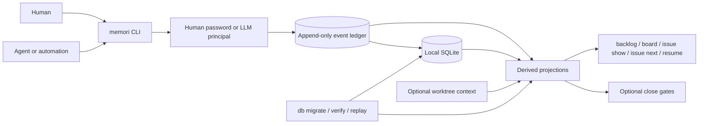

<p align="center">
  
</p>

# memori

**memori** is a local-first issue tracker for human and agent workflows.

It keeps project state in a local SQLite database, records every mutation in an append-only ledger, and gives you one CLI for planning, handoff, resume, and closeout.

## What matters most

- local-first: no server, no web UI, no hosted control plane
- issue-centric: `Epic`, `Story`, `Task`, and `Bug` with parent-child links
- replayable: derived state can be rebuilt from the event ledger
- continuity-aware: sessions, packets, focus, and worktree context help humans and agents resume work cleanly
- auditable: human and LLM writes are distinct
- disciplined closeout: optional close gates let you require proof before a cycle closes

The default database path is `.memori/memori.db`.

## Who it is for

memori is a good fit if you want:

- a project-local tracker instead of a hosted SaaS tool
- one place to manage both human work and agent work
- deterministic history and replay instead of mutable ticket state with weak auditability
- explicit handoff and resume flows when context gets dropped

memori is probably not a fit if you want:

- multi-user hosted collaboration
- a browser UI
- polished cloud integrations
- a lightweight todo app with no operational opinion

## Architecture



The important model is simple: the CLI appends events, the database stores both the raw ledger and derived projections, and the user-facing views come from those projections rather than ad hoc mutable state.

## Install

The recommended install path is the published release installer:

```bash
curl -fsSL https://raw.githubusercontent.com/willbastian/memori/main/scripts/install_release.sh | bash
memori version
```

To pin a specific release:

```bash
curl -fsSL https://raw.githubusercontent.com/willbastian/memori/main/scripts/install_release.sh | bash -s -- --version v0.2.1
```

If you want a source install, prefer an explicit version tag:

```bash
go install github.com/willbastian/memori/cmd/memori@v0.2.1
memori version
```

If you are working inside this repository itself, prefer the repo-local entrypoint so the binary matches the checked-out code and schema:

```bash
go run ./cmd/memori help
```

## Quick Start

From the root of the repository you want to track:

```bash
memori init --issue-prefix acme --append-agents-md
memori auth set-password
memori issue create --type task --title "First ticket"
memori board
```

That gives you:

- a local database at `.memori/memori.db`
- generated issue keys like `acme-a1b2c3d`
- an `AGENTS.md` block with Memori workflow guidance
- authenticated human writes

## Daily Loop

The normal human loop is:

```bash
memori board
memori issue show --key acme-a1b2c3d
memori issue update --key acme-a1b2c3d --status inprogress
```

When you pause or finish:

```bash
memori issue update --key acme-a1b2c3d --status blocked --note "waiting on review"
memori issue update --key acme-a1b2c3d --status done --note "shipped"
```

When you want ranked recovery or resume help:

```bash
memori issue next --agent writer-1 --json
memori context resume --agent writer-1 --json
```

## Human And Agent Writes

Human writes are authenticated interactively.

```bash
memori auth set-password
memori auth status
```

After that, mutating commands prompt for the configured password.

Agent or automation writes must declare an LLM principal first:

```bash
export MEMORI_PRINCIPAL=llm
export MEMORI_LLM_PROVIDER=openai
export MEMORI_LLM_MODEL=gpt-5
export MEMORI_ALLOW_MANUAL_COMMAND_ID=1
```

If an agent skips `MEMORI_PRINCIPAL=llm`, Memori treats that caller as a human writer and mutating commands will prompt for the configured human password.

## Worktrees

Memori can track a Git worktree as the execution context for an issue, but it does not create, switch, or delete Git worktrees for you.

Typical flow:

```bash
memori worktree adopt-cwd --branch feature/acme-a1b2c3d
memori worktree attach --worktree wt-123 --issue acme-a1b2c3d
memori issue show --key acme-a1b2c3d
memori board
```

Once attached, worktree context appears in issue, board, next-work, and resume flows.

## Gates

Memori supports optional close gates when you want an immutable close contract for a specific issue cycle.

If you do not attach and lock a gate set, an issue can still close normally. If you do attach and lock a gate set, required gates must pass before the issue can move to `done`.

That means you can use Memori as:

- a local issue tracker with no gates at all
- a tracker plus explicit verification contracts where they matter

## Upgrade Safely

Before upgrading an existing repo, back up the database and verify the schema:

```bash
memori version
memori db status
memori db backup --out /tmp/memori-pre-upgrade.db --json
memori db migrate --json
memori db verify --json
```

Older binaries may not understand newer schema versions, so upgrade the binary before working with a database that has been migrated forward.

## Current Boundaries

memori is useful today, but it is still intentionally narrow:

- single-user and local-only
- CLI-first product surface
- no hosted sync
- no web UI
- external integrations are minimal
- workflows are still evolving

## Project Status

memori is actively developed and already usable for disciplined local execution, especially in repositories that mix human work and agent work.

It should be treated as an early but real tool, not a finished platform.

## License

memori is available under the MIT license. See [LICENSE](LICENSE).
